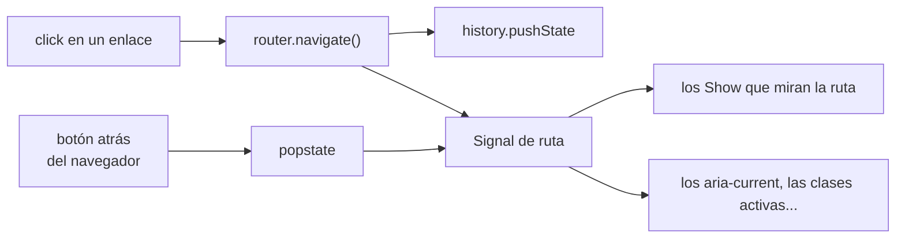
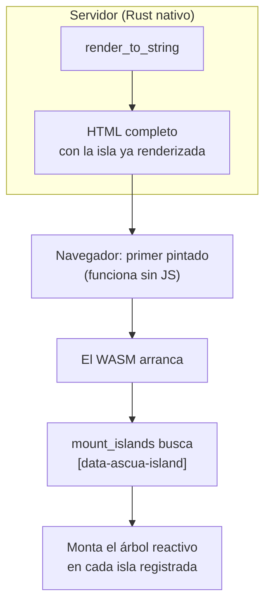
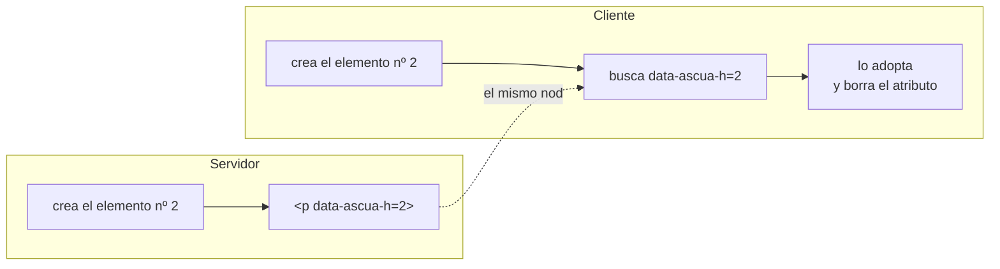

# Router, SSR e islas

Las tres piezas que convierten el framework en algo con lo que se puede
construir una página entera. Ninguna añade un runtime nuevo: el router es un
signal, el SSR es otro backend y las islas son un atributo en el HTML.

---

## El router es un signal

No hay componente `<Router>` que envuelva la aplicación, ni contexto que
propagar, ni re-render al navegar. **La ruta actual es un `Signal<String>`**, y
todo lo demás sale de ahí:

```rust
let router = Router::new(WebHistory::from_window()?);

view! { dom,
    <main>
        <Show when={move || router.matches("/")}>
            <Portada/>
        </Show>
    </main>
}
```

Leer la ruta dentro de un efecto suscribe ese efecto a los cambios, igual que
cualquier otro estado. Navegar es escribir en el signal, y el subárbol que
dependía de la ruta —solo ese— se reconstruye.



El botón "atrás" del navegador entra por el mismo sitio: el listener de
`popstate` escribe en el signal, y la aplicación no distingue una navegación
interna de una externa.

### Patrones de ruta

| Patrón | Casa con | No casa con |
|---|---|---|
| `/tareas` | `/tareas`, `/tareas/` | `/tareas/1` |
| `/tareas/:id` | `/tareas/1` | `/tareas` |
| `/archivos/*resto` | `/archivos/a/b/c` | `/archivos` |

```rust
if let Some(params) = router.params("/tareas/:id") {
    let id = params.get("id");
}
```

La query y el fragmento no forman parte del emparejado: `/buscar/rust?p=2` casa
con `/buscar/:termino`.

### Enlaces

`router.link(dom, &nodo, "/ruta")` pone el `href` **y** captura el click. El
`href` importa: el enlace sigue siendo un enlace de verdad, copiable, abrible
en otra pestaña y visible para un buscador. El click se cancela con
`prevent_default` y navega sin recargar.

### Sin navegador

`MemoryHistory` implementa el mismo trait `History`, así que el router entero
se prueba con `cargo test` y sirve tal cual para renderizar en servidor, donde
la ruta viene de la petición en vez de la barra de direcciones.

---

## SSR: el mismo código, otro backend

Renderizar en servidor no necesita un runtime aparte. `MemoryBackend` construye
el árbol en memoria y lo serializa:

```rust
let html = render_to_string(|dom| app(dom, Estado::nuevo(router)));
```

Los componentes son genéricos sobre `Backend`, así que **el mismo código**
produce el HTML en el servidor y la interfaz viva en el navegador. En
`examples/demo` eso es literal: `src/app.rs` lo usan tanto el binario que
genera el HTML como el `cdylib` que se compila a WASM.

Los efectos se ejecutan una vez para producir el HTML y el scope se libera al
terminar: en el servidor no queda nada vivo.

---

## Islas

Una página servida desde el servidor es HTML muerto: sin efectos, sin
listeners. Las **islas** son las regiones que sí se activan en el cliente.



En el servidor:

```rust
let isla = island(dom, "app", "", |dom| app(dom, estado));
```

que produce
`<ascua-island data-ascua-island="app" ...>…contenido renderizado…</ascua-island>`.

En el cliente:

```rust
type Backend_ = HydratingBackend<WebBackend>;

let islas: Vec<(&str, IslandBuilder<Backend_>)> = vec![
    ("app", Box::new(|dom, props| app(dom, Estado::nuevo(router_de(props))))),
];
let (montajes, estadisticas) = hydrate_islands(backend, &islas);
```

Los props viajan como texto en un atributo. No hay serializador: el formato lo
elige quien usa la isla y el constructor del cliente lo interpreta, así el
framework no arrastra una dependencia de serialización que no todo el mundo
necesita.

Las islas cuyo nombre no esté registrado **se dejan intactas**, lo que permite
desplegar servidor y cliente por separado sin que la página se rompa.

---

## Hidratación

El cliente **adopta** los nodos del servidor: el `<li>` que escribió el
servidor es el mismo `<li>` al que queda atado el efecto. No se reemplaza nada,
así que no hay parpadeo ni se pierde lo que el navegador ya tenía (foco,
scroll, un `<input>` a medio escribir).

### El problema de emparejar

Emparejar por posición no funciona. El runtime crea el marcador de una lista
*antes* que sus items, pero en el HTML el marcador queda *después*: cualquier
recorrido posicional se desalinea en la primera lista que encuentra.

### La solución: numerar

El codegen construye en un orden **determinista** —preorden del template—, así
que basta con numerarlo:



Los comentarios no admiten atributos, así que los marcadores llevan su número
**dentro**: `<!--5-->`, que se vacía al adoptarlo. Elementos y marcadores
comparten el mismo contador.

La numeración es **relativa a cada isla**: el cliente solo construye el
contenido de la isla, y fuera de ella no se numera nada porque no hay nada que
hidratar.

### Los nodos de texto

No llevan número: se resuelven por posición dentro de su padre, que para
entonces ya está adoptado. Al insertarse, se comparan con el siguiente hijo
pendiente de ese padre y se adoptan si son del mismo tipo.

### Cuando no encaja

Si el servidor renderizó otro estado, falta un nodo o alguien editó el HTML,
ese nodo se **crea** y la aplicación sigue. La hidratación no es todo o nada:
cada nodo se adopta o se crea por su cuenta.

`hydrate_islands` devuelve las estadísticas para poder comprobarlo:

```rust
let (montajes, estadisticas) = hydrate_islands(backend, &islas);
// Estadisticas { adoptados: 37, creados: 0 }
```

En el demo, esas son las cifras reales medidas en el navegador: **37 nodos
adoptados, cero creados**, y los 21 elementos de la isla siguen siendo los
mismos objetos que marcó un script antes de que arrancara el WASM.
