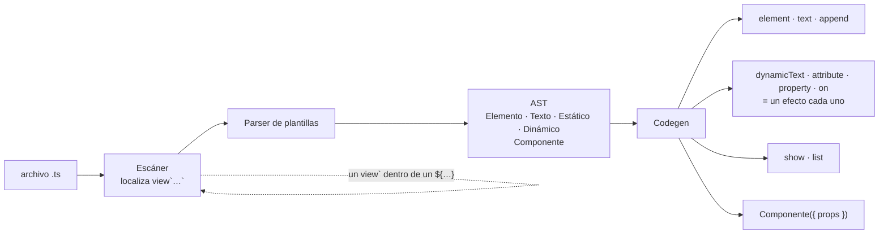

# Plantillas en TypeScript

Una plantilla de Ascua es **HTML de verdad dentro de TypeScript**:

```ts
const boton = view`
  <button class="contador" onclick=${() => cuenta.update((c) => c + 1)}>
    Clicks: ${() => cuenta()}
  </button>`;
```

`view` no existe en tiempo de ejecución. El compilador la sustituye por las
llamadas que construyen ese árbol, más un efecto por cada punto que lee un
signal. Los atributos son los del HTML —`class`, `onclick`, no `className` ni
`onClick`—, así que el marcado se puede copiar y pegar tal cual.

> Esto es la vía TypeScript. La macro `view!` de la vía Rust está en
> [`templates.md`](templates.md); las reglas son las mismas, la sintaxis no.

## La regla única

**Una closure es reactiva. Cualquier otra expresión se evalúa una vez.**

| Escribes | Qué ocurre |
|---|---|
| `${cuenta()}` | Inserta el valor actual. No vuelve a mirarlo nunca. |
| `${() => cuenta()}` | Crea un efecto. Ese nodo sigue al signal. |
| `class="fijo"` | Atributo estático. |
| `class=${expresion}` | Se evalúa una vez, al construir. |
| `class=${() => ...}` | Atributo reactivo. Con `false`/`null` se quita. |
| `onclick=${manejador}` | Listener del DOM. Se quita solo al desmontar. |
| `prop:value=${() => ...}` | Escribe la **propiedad**, no el atributo. |
| `class:activa=${() => ...}` | Pone y quita **esa** clase, sin tocar las demás. |
| `ref=${(nodo) => ...}` | Le entrega el elemento recién creado a una función. |

La distinción es **sintáctica**, no de tipos: mirando la plantilla se sabe qué
puede cambiar, sin conocer los tipos ni confiar en ninguna regla implícita.

De ahí sale la trampa más fácil de pisar, que conviene conocer antes que
después:

```ts
function Metrica(props: { valor: () => string }) {
  return view`<span>${props.valor}</span>`;       // ✗ pinta "() => ..."
  return view`<span>${() => props.valor()}</span>`; // ✓ sigue al dato
}
```

`props.valor` **es** una función, pero ahí no hay una closure escrita, y la
regla mira lo que está escrito. Un prop reactivo se reenvía llamándolo dentro
de otra closure.

## `prop:` — propiedades, no atributos

```ts
<input prop:value=${() => texto()} oninput=${(e) => texto.set(e.target.value)}>
```

El atributo `value` de un `<input>` es su valor *inicial*: deja de mandar en
cuanto el usuario teclea. La propiedad manda siempre. Es la diferencia entre
poder vaciar un formulario desde el código y no poder, así que `value`,
`checked` y `selected` van con `prop:`.

Sigue valiendo la regla: con una closure es reactivo, y sin ella se escribe una
vez y ya.

## Clases que van y vienen

`class` entero es un atributo como otro cualquiera, así que cambiarlo obliga a
construir la lista a mano. Para una clase suelta está `class:`:

```ts
view`<li class="fila" class:hecha=${() => tarea.hecha()}>…</li>`;
```

`fila` se queda siempre; `hecha` aparece y desaparece. No se pisan, y el scope
del CSS tampoco.

## Quedarse con un nodo

```ts
let campo: HTMLInputElement | null = null;

view`<input ref=${(nodo: HTMLInputElement) => (campo = nodo)}>`;
```

`ref` no pasa por el runtime: el compilador emite la llamada justo después de
crear el elemento. Se ejecuta **en cada construcción**, así que tras un `<Show>`
que reconstruye, la variable apunta al nodo nuevo.

## Componentes

**La inicial decide: minúscula es HTML, mayúscula es componente.**

Un componente es una función que recibe props y devuelve un nodo:

```ts
function Tarjeta(props: { titulo: string; children?: Children }) {
  const caja = view`
    <section class="tarjeta">
      <h2>${props.titulo}</h2>
      <div class="cuerpo"></div>
    </section>`;

  props.children?.(caja.querySelector(".cuerpo")!);
  return caja;
}

view`<main><Tarjeta titulo="Resumen"><p>Contenido</p></Tarjeta></main>`;
```

`<Tarjeta titulo="Resumen"/>` se compila a `Tarjeta({ titulo: "Resumen" })`, que
es exactamente lo que se puede escribir a mano. No hay clase base, ni ciclo de
vida, ni registro: la plantilla no da acceso a nada que no estuviera ya al
alcance.

Los props llegan **tal cual**: un literal es una cadena y un `${...}` es esa
expresión, sea o no una closure. En un componente, `onguardar=${fn}` es un prop
suyo, no un listener del DOM.

### Hijos

`children` no son nodos ya construidos, sino la **receta** para construirlos:
una función que recibe el elemento donde deben ir. El componente decide dónde
—y si— los pone, y un `<Show>` dentro del contenido encuentra el padre real que
necesita para anclarse.

```ts
type Children = (padre: Node) => void;
```

## Control de flujo

### `<Show>` — contenido que aparece y desaparece

```ts
view`
  <div>
    <Show when=${() => sesion() !== null}>
      <Panel sesion=${() => sesion()!}/>
      <Else>
        <Login onentrar=${(s) => sesion.set(s)}/>
      </Else>
    </Show>
  </div>`;
```

`when` es lo único reactivo. Cada rama se construye **dentro de su función**:
la que no se muestra no existe todavía, ni sus nodos ni sus efectos. Al cambiar
la condición, el scope de la rama anterior se libera entero —efectos, memos,
listeners, `onCleanup`— y se construye la otra.

Si `when` devuelve el mismo valor que ya tenía, no se reconstruye nada: alternar
un booleano que ya era `true` no toca el DOM.

`<Else>` es opcional, va dentro del `<Show>` y solo puede haber uno.

### `<For>` — listas con clave

```ts
view`
  <ul>
    <For each=${() => tareas()}
         key=${(t: Tarea) => t.id}
         render=${(t: Tarea) => view`<li>${t.titulo}</li>`}/>
  </ul>`;
```

`render` se ejecuta **una vez por clave**. Mientras una clave siga en la lista,
su nodo se conserva y se mueve; no se reconstruye. Eso preserva lo que el
framework no controla: el foco, el scroll, un `<input>` a medio escribir.
Reordenar una lista que no cambió no produce ni una operación de DOM.

Como el nodo no se rehace, **para que el contenido de un item cambie, el item
tiene que leer un signal por su cuenta**:

```ts
interface Fila { id: number; estado: Signal<Estado> }

render=${(fila: Fila) => view`
  <li data-estado=${() => fila.estado()}>${() => fila.estado()}</li>`}
```

Así, avanzar un pedido escribe en un nodo de texto y en un atributo, y ni la
lista ni las demás filas se enteran.

## Cuando una vista falla

Un error dentro de un efecto se lleva por delante lo que lo rodea, a menos que
alguien se haga cargo:

```ts
import { onError, signal } from "ascua";

function Seccion() {
  const fallo = signal<string | null>(null);
  onError((error) => fallo.set(String(error)));

  return view`
    <section>
      <Show when=${() => fallo() === null}>
        <Contenido/>
        <Else><p class="error">${() => fallo()}</p></Else>
      </Show>
    </section>`;
}
```

El manejador corre en **su** scope, no en el que falló, así que lo que escriba
sobrevive a lo que se está derrumbando. Sin ninguno registrado, el error se
propaga como siempre: nada se traga en silencio.

## Estilos

Un `<style>` dentro de una plantilla se extrae al compilar: sus selectores se
reescriben para aplicar solo a los elementos de *esa* plantilla, y no queda
nada en tiempo de ejecución.

```ts
view`
  <p class="nota">
    Hola
    <style>.nota { color: #888; }</style>
  </p>`;
```

**El scope es por plantilla.** Tres consecuencias:

1. El CSS de una plantilla **no alcanza a los nodos de sus componentes**. Cada
   componente lleva sus propios estilos, y así nada se filtra hacia dentro.
2. Una plantilla anidada —el `render` de un `<For>`— es otra plantilla con su
   propio scope: sus estilos van dentro de ella.
3. Los nodos creados a mano con `element()` no llevan el atributo del scope.

El CSS no admite `${...}`: se extrae en tiempo de compilación, así que no hay
nada que interpolar. Para estilos que cambian, un atributo reactivo.

## Límites, y por qué

- **Una plantilla tiene un único elemento raíz.** Es lo que permite que montar,
  desmontar e hidratar sean operaciones sobre *un* nodo. Donde los fragmentos
  hacen falta —el contenido de un componente, una rama de `<Show>`— sí están.
- **`<Show>` y `<For>` necesitan un elemento donde anclarse**, porque lo que
  producen es un marcador dentro de un padre. No pueden ser la raíz, ni colgar
  directamente de una rama de otro `<Show>`: hace falta un elemento de por
  medio, y lo escribe quien sabe cuál debe ser.
- **`${expr}` nunca inserta un nodo**: un hueco siempre es texto. Para componer
  árboles, un componente. Distinguirlo por el tipo del valor sería adivinar la
  intención.

## El editor

Una plantilla es marcado dentro de una cadena, así que el editor no lo colorea
por su cuenta. Las extensiones que sí lo hacen —lit-html, es6-string-html—
buscan que la etiqueta se llame `html`, y por eso el compilador acepta los dos
nombres:

```ts
const boton = html`<button class="grande">Hola</button>`;   // igual que view
```

Son la misma cosa: `view` deja claro de qué va, `html` enciende el color. Con
cualquiera de las dos, dentro se cierran las etiquetas solas y el autocompletado
de atributos funciona.

Si prefieres quedarte con `view`, algunas extensiones también reconocen un
comentario delante, que el compilador ignora:

```ts
const boton = /* HTML */ view`<button>Hola</button>`;
```

## Cuando algo falla

El compilador emite un **source map**, así que un error del navegador señala el
archivo que escribiste y no el que salió de aquí. Lo que se copia sin tocar
—casi todo— apunta a su línea exacta; lo que genera una plantilla apunta a la
línea del `view` que lo produjo, que es donde hay que mirar.

El mapa lleva dentro el TypeScript original (`sourcesContent`), de modo que las
herramientas del navegador lo enseñan aunque el archivo no esté servido en
ninguna parte.

Con el plugin de Vite no hay que hacer nada. A mano:

```sh
ascuac --json --origen src/panel.ts src/panel.ts
# {"code": "...", "css": "...", "map": {"version": 3, ...}}
```

Los errores de compilación, en cambio, salen por la vía de siempre y con la
línea de la plantilla que los causó:

```text
ascuac: línea 42: <For> necesita `render`: <For each=${() => items()} …/>
```

## Cómo se compila



El resultado de `<p>${() => cuenta()}</p>` es literalmente:

```js
const _n0 = _$el("p");
const _n1 = _$dtxt(() => cuenta());
_$add(_n0, _n1);
```

Se puede ver con `ascuac < archivo.ts`, o en el
[playground](https://ascua.gitweave.run/playground/). Es una propiedad buscada:
si el output del compilador no se puede leer, la magia ha vuelto por la puerta
de atrás.
