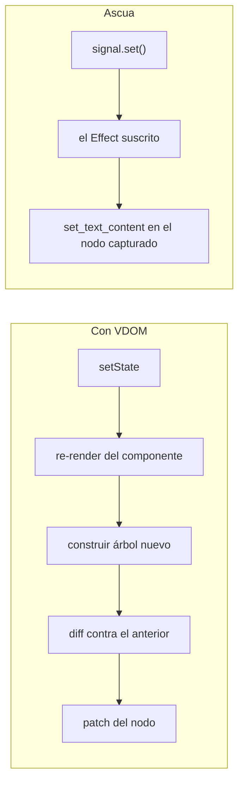
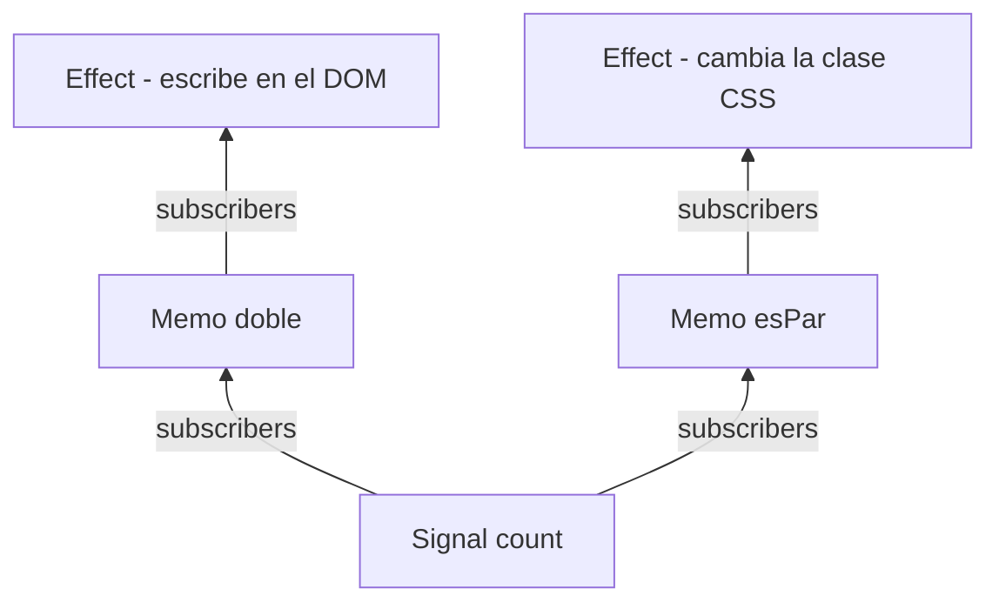
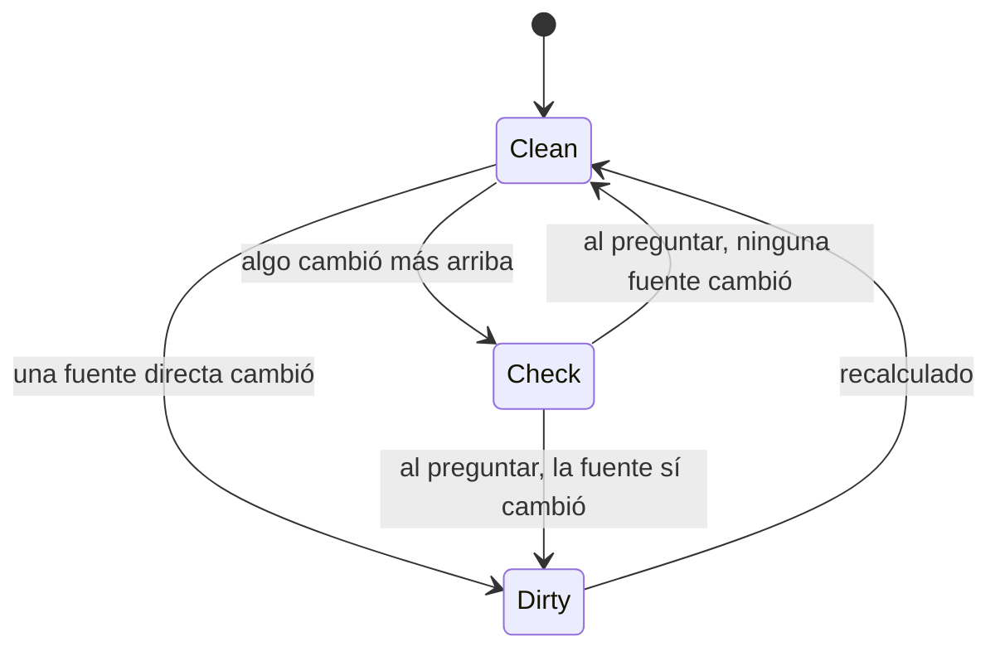
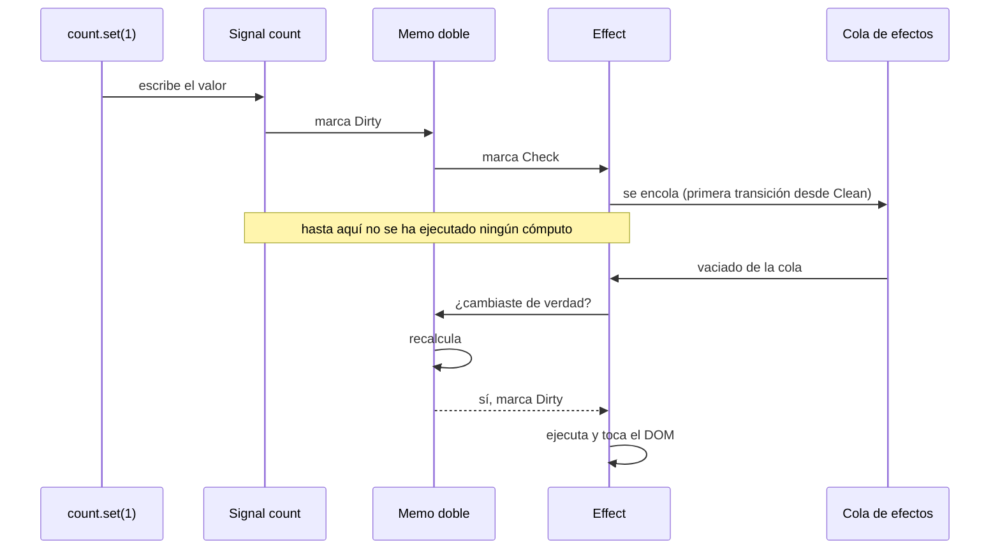
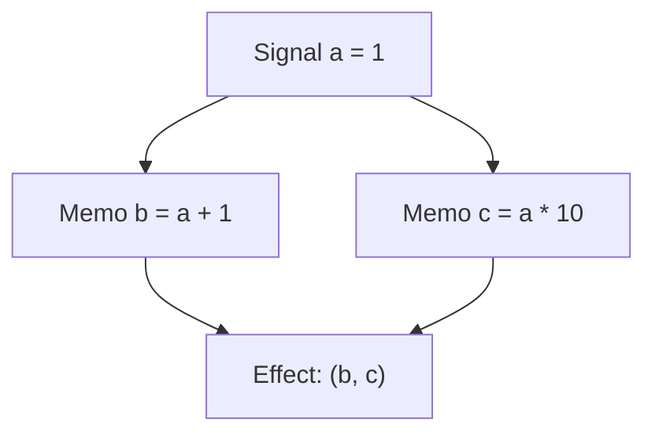
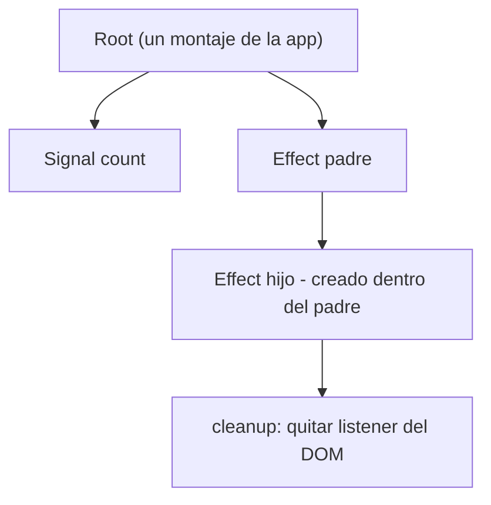

# El modelo de reactividad de Ascua

Este documento describe el mecanismo completo de `ascua-reactive`. Está escrito
para que una persona pueda auditar el sistema entero en una sesión de lectura,
que es uno de los objetivos declarados del proyecto: si un día hay que reparar
esto sin ayuda de nadie, el mapa tiene que caber en la cabeza.

Orden de lectura del código: `slab.rs` → `runtime.rs` → `signal.rs` /
`memo.rs` / `effect.rs` / `scope.rs`.

---

## 1. Por qué no hay Virtual DOM

Un framework con VDOM responde a un cambio de estado reconstruyendo una
representación del árbol y comparándola con la anterior para deducir qué tocar.
El trabajo es proporcional al tamaño del árbol, no al tamaño del cambio.

Ascua invierte el planteamiento: **la relación entre un dato y el nodo del DOM
que lo muestra se establece una sola vez**, cuando el template se compila. A
partir de ahí, cambiar el dato ejecuta directamente la operación de DOM que le
corresponde. No hay nada que deducir porque nada se olvidó.



La pieza que hace posible la columna de la derecha es el grafo reactivo que
describe el resto del documento.

---

## 2. Los tres primitivos

| Primitivo | Qué es | Tiene valor | Se recalcula |
|---|---|---|---|
| `Signal<T>` | Estado. La única fuente de verdad escribible. | Sí | Nunca |
| `Memo<T>` | Valor derivado de otros nodos. | Sí | Perezosamente, al leerlo |
| `Effect` | Trabajo con efecto lateral (tocar el DOM). | No | Al terminar la escritura que lo ensucia |

Un solo tipo de nodo los representa a los tres en el runtime. Lo que cambia es
si tiene valor, si tiene cómputo y si alguien lo observa.

```rust
let count = Signal::new(0);
let doble = create_memo(move || count.get() * 2);   // depende de count
create_effect(move || println!("{}", doble.get())); // depende de doble
count.set(21);                                      // imprime 42
```

Nadie declaró esas dependencias. Se descubrieron solas: mientras un efecto o un
memo se ejecuta, el runtime anota qué nodos leyó. **Suscripción por lectura, no
por declaración.**

---

## 3. El grafo

Cada nodo guarda dos listas: sus `sources` (lo que leyó) y sus `subscribers`
(quién lo leyó). La relación es bidireccional porque las dos direcciones se
recorren: hacia arriba para propagar marcas, hacia abajo para preguntar si hace
falta recalcular.



Los nodos no viven en un grafo de `Rc`. Viven en una arena con generaciones
(`slab.rs`) y se referencian por un `NodeId` de 8 bytes que es `Copy`. Esto no
es una optimización, es una necesidad de corrección: con referencias contadas,
un grafo bidireccional es un grafo de ciclos, es decir, fugas de memoria
garantizadas. La arena convierte la liberación en una operación explícita.

---

## 4. Propagación: marcar es barato, recalcular no

Escribir en un signal **no ejecuta nada**. Solo marca. Cada nodo tiene uno de
tres estados:



`Dirty` significa "hay que recalcular". `Check` significa "quizá, pregunta
antes". Esa distinción es lo que evita trabajo inútil: un nodo en `Check`
consulta a sus fuentes y, si ninguna acabó cambiando de valor, vuelve a `Clean`
sin ejecutar su cómputo.

La secuencia completa de una escritura:



Dos propiedades salen de ahí:

- **Un memo que recalcula al mismo valor no despierta a nadie.** `count > 2` con
  `count` pasando de 0 a 1 a 2 no repinta nada.
- **Un nodo se encola una sola vez**, porque solo se encola en la transición
  desde `Clean`.

---

## 5. El problema del diamante

Es el caso que rompe las implementaciones ingenuas. Dos derivados del mismo
signal alimentan al mismo efecto:



Con propagación ingenua (cada cambio ejecuta a sus suscriptores en cascada),
`a.set(2)` ejecuta el efecto dos veces, y la primera vez lee `(3, 10)`: un
estado que nunca existió, mezcla del valor nuevo de `b` con el viejo de `c`.
Eso es un *glitch*.

Aquí el efecto se ejecuta **una vez** y lee `(3, 20)`, porque el marcado y el
recálculo son fases separadas: primero se marca todo el subgrafo afectado, y
solo cuando la marca ha terminado de propagarse se vacía la cola. El test
`diamante_sin_glitch_ni_ejecucion_doble` fija esa garantía.

---

## 6. Memoria: árbol de pertenencia, no recolector

Todo nodo tiene un dueño: el scope que estaba activo cuando se creó. Liberar un
dueño libera su subárbol completo, en orden determinista.



Cuando el efecto padre se reejecuta, antes de correr su cuerpo el runtime:

1. ejecuta los `on_cleanup` de su última ejecución,
2. libera los nodos hijos que creó entonces,
3. borra sus suscripciones anteriores.

El paso 3 es lo que hace que **las dependencias sean dinámicas**: una rama `if`
que deja de ejecutarse deja de despertar al efecto. El paso 2 es lo que evita
que un componente desmontado siga vivo reaccionando a cambios.

No hay recuento de referencias que pueda quedar atrapado en un ciclo. Hay un
árbol, y se poda.

---

## 7. Invariantes que debe cumplir el runtime

Son las propiedades que fija la suite de tests. Si alguna se rompe al modificar
el runtime, el modelo dejó de ser correcto:

1. Un efecto se ejecuta una vez al crearse y una vez por cada cambio que le
   afecte. Nunca dos veces por el mismo cambio.
2. Un efecto nunca observa un estado intermedio inconsistente (sin glitches).
3. Un memo no se ejecuta hasta que alguien lo lee.
4. Un memo cuyo valor recalculado es igual (`PartialEq`) no propaga nada.
5. Las dependencias se recalculan en cada ejecución: lo no leído no despierta.
6. Liberar una raíz deja el grafo exactamente como estaba antes de crearla
   (`live_node_count()` lo verifica).
7. Un `cleanup` corre antes de cada reejecución de su scope y una última vez al
   liberarlo.
8. Dentro de un `batch`, N escrituras producen como mucho una ejecución por
   efecto afectado.

---

## 8. Cómo encaja con el compilador de templates

El compilador traduce esto:

```rust
view! {
    <p>"Total: " {count}</p>
}
```

a esto (`ascua-macro`, codegen literal):

```rust
let p = document.create_element("p")?;
let texto = document.create_text_node("");
p.append_child(&texto)?;
create_effect(move || {
    texto.set_text_content(Some(&count.get().to_string()));
});
```

El `Effect` captura el nodo de texto concreto. Por eso no hace falta diffing: la
actualización ya sabe su destino. Todo lo que el compilador tiene que hacer es
colocar un efecto en cada punto del template que lea un signal.

Esto se puede comprobar en el navegador, y el demo `examples/contador` lo hace:
después de cuatro clicks, el nodo `<p>` y su nodo de texto siguen siendo
**exactamente los mismos objetos** del DOM que al montar. Solo cambió su
contenido.

El único lugar donde hará falta algo parecido a un diff es la reconciliación de
listas con clave (`for`), porque ahí la estructura sí cambia de forma que no se
puede predeterminar. Es un diff local y acotado, no un recorrido del árbol
entero.
