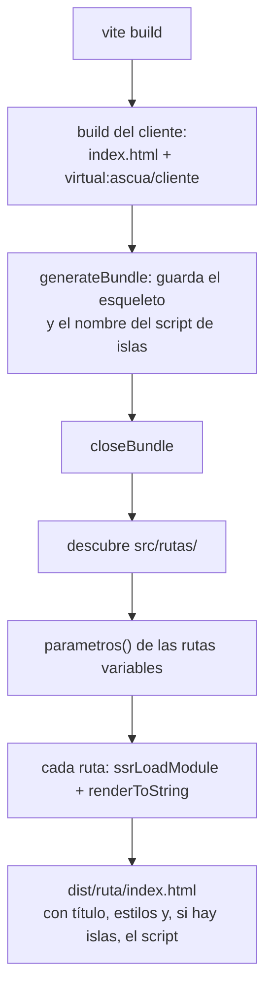

# Sitios: de `src/rutas/` a HTML listo para subir

El meta-framework de Ascua. `stil run build` —que es `vite build`— deja
en `dist/` una página HTML por ruta, con sus estilos dentro y el JavaScript
justo para las islas. Nada más que servir archivos: Hull con `serve: static`,
un `tower-http` en Rust o cualquier CDN.

No hay bundler propio ni servidor propio. Es una opción de `vite-plugin-ascua`:

```ts
// vite.config.ts
import ascua from "vite-plugin-ascua";

export default { plugins: [ascua({ sitio: true })] };
```

## Las fases

| Fase | Qué | Estado |
|---|---|---|
| 1 | **Estático (SSG)**: rutas por archivo, marco, islas, `404`, desarrollo con recarga | hecha |
| 2 | **Datos por ruta**: `cargar()`, `descripcion`, `noExiste()`, rutas que son archivos (`sitemap.xml.ts`), esqueleto propio | hecha |
| 3 | **Servidor Node**: `modo: "servidor"`, SSR en cada petición, un `index.mjs` con todo dentro | hecha |

El primer usuario es la documentación del propio sitio de Ascua: sus rutas
están en `web/rutas/docs/`, con su esqueleto en `web/docs/esqueleto.html`, y
el índice de búsqueda es una ruta-archivo, `busqueda.js.ts`.

Fuera, a propósito: Server Components, un runtime de servidor y un bundler
propio. El runtime del navegador no cambia: sigue siendo el de 2,25 kB.

## Convenciones

```
index.html              opcional: el esqueleto de todas las páginas
src/rutas/
  _marco.ts             opcional: envuelve todas las páginas
  index.ts              /
  acerca.ts             /acerca
  pedidos/index.ts      /pedidos
  pedidos/[id].ts       /pedidos/:id   (uno por cada id de parametros())
  404.ts                404.html
src/islas/*.ts          lo que se hidrata; se registran solas
```

Un archivo que empieza por `_` no es una ruta. `[nombre]` es un segmento
variable, y `[...resto]`, al final, atrapa lo que quede de la URL con sus
barras.

### Una página

```ts
// src/rutas/pedidos/[id].ts
import { PEDIDOS } from "../../datos.js";

export const titulo = ({ id }: { id: string }) => `Pedido ${id}`;

/** Qué páginas generar: una por objeto. Obligatorio en las rutas variables. */
export function parametros() {
  return PEDIDOS.map((p) => ({ id: p.id }));
}

export default function Pedido({ id }: { id: string }) {
  return view`<article><h1>Pedido ${id}</h1></article>`;
}
```

- `default`: el componente de la página. Recibe los parámetros como props.
- `titulo`: una cadena o una función de los parámetros. Va al `<title>`.
- `parametros()`: síncrona o asíncrona. Corre al construir.

El código de las páginas **no llega al navegador**: corre al construir y
queda como HTML. Lo interactivo va en islas (`defineIsland`), que la página usa
como cualquier componente.

### El marco

```ts
// src/rutas/_marco.ts
import type { Children } from "ascua";

export default function Marco(props: { ruta: string; children: Children }) {
  const marco = view`<div><header>…</header><main></main></div>`;
  props.children(marco.querySelector("main")!);
  return marco;
}
```

Es un componente con hijos como cualquier otro. Puede haber uno por carpeta:
el de la raíz envuelve al de `pedidos/`, que envuelve a sus páginas.

### El esqueleto

Si hay `index.html`, se usa como esqueleto de cada página: pasa por Vite como
siempre, así que sus `<link>` a hojas globales acaban con su hash. La página
va donde esté `<!--ascua-->`, o al principio de `<body>` si no está. Sin
`index.html`, se usa uno mínimo.

A cada página se le añaden:

- el `<title>`, si la ruta define `titulo`;
- un `<style>` con los estilos de los componentes que aparecen en ella, y solo
  esos (`collectStyles`);
- **si tiene islas**, el script que las hidrata y su CSS. Una página sin islas
  sale sin una línea de JavaScript.

## Cómo construye



- **El cliente** es un módulo virtual que importa todo `src/islas/` con
  `import.meta.glob`, recoge lo que sea una isla y llama a `hydrate`.
- **El prerender** carga las páginas con un servidor de Vite en modo
  middleware, el mismo camino que usa hoy la documentación del sitio de Ascua.
  Así las plantillas pasan por el mismo plugin y `registerStyle` recoge los
  estilos.
- `/` se escribe en `dist/index.html`, `/a/b` en `dist/a/b/index.html` y
  `404.ts` en `dist/404.html`. Busybox `httpd` sirve `a/b/` con su
  `index.html`; para la 404, `E404:/404.html` en su `httpd.conf`.

## En desarrollo

`vite` a secas. Una petición a una ruta se renderiza al vuelo con el mismo
código que el build; tocar una página, el marco o algo que importen recarga el
navegador. Las islas tienen su recarga de siempre.

## Decisiones

- **Una opción del plugin, no un paquete nuevo.** Un proyecto que ya usa
  `vite-plugin-ascua` pasa a sitio con una línea.
- **El prerender con el servidor de Vite y no con un segundo build.** El código
  de las páginas no se publica, así que no gana nada minificado, y se evita
  mantener dos configuraciones.
- **Todas las islas en un solo script.** Más simple, y hoy los sitios tienen
  pocas. Partirlo por página es una mejora posible, no un cambio de diseño.
  Sin islas no hay entrada de cliente: ni script, ni un trozo de runtime
  compartido con otras entradas de Vite.
- **`cargar()` y no datos en el componente.** El componente sigue siendo
  síncrono, como todos en Ascua; lo asíncrono va antes, y su resultado llega
  como props. En el build y con servidor es el mismo código.
- **El servidor con todo dentro** (`ssr.noExternal`). Un `index.mjs` que
  arranca sin `node_modules` es lo más fácil de desplegar en Hull o en un
  contenedor mínimo.
- **`noExiste()` es una marca, no una clase.** El servidor lleva su propia
  copia del módulo, y `instanceof` fallaría entre las dos.
- **`parametros()` y no rastrear enlaces.** Explícito: lo que se genera es lo
  que la ruta dice, sin adivinar a partir del HTML.
