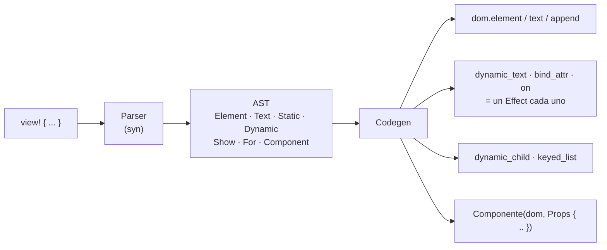

# La macro `view!`

> Esto documenta la **vía Rust**. La vía recomendada hoy es TypeScript con el
> compilador en WebAssembly: [`plantillas-ts.md`](plantillas-ts.md).

`view!` es el compilador de templates de Ascua: traduce marcado a las llamadas
de DOM que lo construyen, más un efecto por cada punto dinámico. No genera
ninguna estructura intermedia en tiempo de ejecución.

```rust
view! { dom,
    <div class="contador">
        <button on:click={move |_| count.update(|c| *c += 1)}>"+1"</button>
        <span class={move || if count.get() > 9 { "alto" } else { "bajo" }}>
            {move || count.get()}
        </span>
    </div>
}
```

## La regla única

**Una closure es reactiva. Cualquier otra expresión se evalúa una vez.**

| Escribes | Qué ocurre |
|---|---|
| `{count.get()}` | Inserta el valor actual. No vuelve a mirarlo nunca. |
| `{move \|\| count.get()}` | Crea un efecto. Ese nodo sigue al signal. |
| `class="fijo"` | Atributo estático. |
| `class={expresion}` | Se evalúa una vez al construir. |
| `class={move \|\| ...}` | Atributo reactivo. Si devuelve `None`, se quita. |

La distinción es **sintáctica**, no de tipos. Mirando el template se sabe qué
puede cambiar y qué no, sin conocer los tipos involucrados ni confiar en
ninguna regla implícita. Es una decisión deliberada contra la "magia": el
framework no adivina tus intenciones.

## Elementos y componentes

Los tags que empiezan por **minúscula** son elementos HTML. Los que empiezan por
**mayúscula** son componentes: la misma convención que usa Rust para distinguir
tipos de valores.

```rust
#[component]
fn Etiqueta<B: Backend>(dom: &Dom<B>, texto: String, tono: &'static str) -> B::Node {
    view! { dom, <span class={tono}>{texto}</span> }
}

view! { dom, <div><Etiqueta texto="Listo" tono={"exito"}/></div> }
```

`#[component]` genera un struct `EtiquetaProps` a partir de la firma, porque
Rust no tiene argumentos con nombre. El componente sigue siendo **una función
normal**: se puede llamar a mano con `Etiqueta(dom, EtiquetaProps { .. })`, y la
macro no esconde nada que no se pueda escribir sin ella.

Los props se pasan por valor y no son reactivos por sí mismos: para que un prop
cambie con el tiempo, pásale un `Signal` (que es `Copy`) o una closure.

### Props opcionales

Un prop con `#[prop(default)]` se puede omitir:

```rust
#[component]
fn Aviso<B: Backend>(
    dom: &Dom<B>,
    texto: String,                                          // obligatorio
    #[prop(default)] cerrable: bool,                        // Default::default()
    #[prop(default = "info".to_string())] tono: String,     // valor propio
) -> B::Node { ... }

view! { dom, <div><Aviso texto="Listo"/></div> }
view! { dom, <div><Aviso tono="error" cerrable={true} texto="Falló"/></div> }
```

El orden no importa, y **olvidar un prop obligatorio es un error de
compilación**, no un fallo en ejecución:

```text
error: faltan props obligatorios: este componente necesita texto
  --> src/main.rs:10:13
   |
10 |     view! { dom, <div><Aviso tono="error"/></div> }
   |     ^^^^^^^^^^^^^^^^^^^^^^^^^^^^^^^^^^^^^^^^^^^^^^ a esta llamada le falta
   |                                                     algún prop sin `#[prop(default)]`
```

Eso lo consigue un builder generado por `#[component]`, donde cada prop es un
parámetro const booleano que pasa a `true` al establecerlo; los opcionales
arrancan en `true` y `build` solo se puede llamar cuando todos lo están.

### Hijos

Un componente puede recibir contenido:

```rust
#[component]
fn Panel<B: Backend>(
    dom: &Dom<B>,
    titulo: String,
    #[prop(default)] children: Children<B>,
) -> B::Node {
    let panel = view! { dom, <section class="panel"><h2>{titulo}</h2></section> };
    children.render_into(dom, &panel);
    panel
}

view! { dom,
    <div>
        <Panel titulo="Resumen">
            <p>"Contenido"</p>
            <Show when={move || hay_mas.get()}>
                <p>"Y más"</p>
            </Show>
        </Panel>
    </div>
}
```

`Children` no son nodos ya construidos, sino la receta para construirlos:
`render_into` recibe el elemento donde deben ir, y el componente decide dónde
y cuándo, o no usarlos. Como la receta conoce a su padre, los hijos pueden ser
**cualquier cosa del template**, incluidos `<Show>` y `<For>`, que necesitan un
elemento real donde anclar sus marcadores.

## Control de flujo

### `<Show>` — contenido que aparece y desaparece

```rust
<Show when={move || tareas.with(Vec::is_empty)}
      fallback={<ul class="lista">...</ul>}>
    <p>"No hay nada"</p>
</Show>
```

`when` es una closure que devuelve `bool` y es lo único reactivo. El contenido
se construye en un scope propio: al cambiar la condición, el scope anterior se
libera entero —efectos, memos, listeners, `on_cleanup`— y se construye el otro.

El `fallback` contiene **template**, no una expresión de Rust: es la otra rama
del mismo `if`, y se lee mejor escrita como marcado.

Si la condición devuelve el mismo valor que ya tenía, no se reconstruye nada.

### `<For>` — listas con clave

```rust
<For
    each={move || tareas.get()}
    key={|tarea: &Tarea| tarea.id}
    render={move |dom, tarea: &Tarea| view! { dom, <li>{tarea.titulo.clone()}</li> }}
/>
```

`render` se ejecuta **una vez por clave**. Mientras una clave siga en la lista,
su nodo se conserva y se mueve; no se reconstruye. Eso es lo que preserva el
estado del DOM que el framework no controla: el foco, la posición del scroll, un
`<input>` a medio escribir.

Para que el contenido de un item cambie, el item debe leer signals por su
cuenta dentro de `render`.

## Estilos: `<style>` y scoping

Un bloque `<style>` dentro de un template no genera **nada** en tiempo de
ejecución: ni `<style>` inyectado, ni `insertRule`, ni runtime de estilos. En
tiempo de compilación, la macro calcula un identificador de scope a partir del
contenido, reescribe cada selector para que solo case con los elementos de ese
template y deja el CSS resultante en un archivo:

```rust
view! { dom,
    <article class="nota">
        <h1>"Título"</h1>
        <style>r#"
            .nota { border: 1px solid; }
            h1:hover { opacity: .5; }
        "#</style>
    </article>
}
```

produce `.nota[data-ascua-98909ba2] { ... }` y `h1[data-ascua-98909ba2]:hover
{ ... }`, y pone ese atributo en los elementos del template. El CSS va como
literal de cadena porque el lexer de Rust no sabe leer CSS crudo (`#id`, `50%`,
`.5rem` no son tokens válidos).

Los archivos se escriben en `target/ascua-css/` del crate que compila, o donde
diga la variable `ASCUA_CSS_DIR`. El paso de build los recoge: en
`examples/demo`, el generador de HTML los concatena e incrusta en la página.

**El scope es por template, no por componente.** Tres consecuencias que
conviene tener presentes:

1. El CSS de un template **no alcanza a los nodos de los componentes que use**.
   Cada componente pone sus propios estilos, y así nada se filtra hacia dentro.
2. Un `view!` anidado —el `render` de un `<For>`, por ejemplo— es otro
   template, con su propio scope. Sus estilos van dentro de él.
3. Los nodos creados **a mano** (`dom.element(...)` fuera de un `view!`) no
   llevan el atributo, así que el CSS scopeado no les aplica.

## Límites, y por qué

- **Cada vista tiene un único elemento raíz.** `view!` y `<Show>` no admiten
  varios nodos al mismo nivel. Es deliberado: un nodo raíz es lo que permite
  que montar, desmontar e hidratar sean operaciones simples sobre *un* nodo, en
  lugar de sobre una lista con marcadores de principio y fin. Donde los
  fragmentos hacen falta de verdad —el contenido que se le pasa a un
  componente— sí están: los hijos son una lista y admiten control de flujo.
- **`<Show>`, `<For>` y `<style>` necesitan un elemento donde insertarse.** No
  pueden ser la raíz de un `view!`, por lo mismo.
- **Insertar un nodo ya construido con `{expr}` no funciona**: un bloque
  siempre es texto. Para componer árboles, usa un componente. Distinguirlo por
  tipo exigiría un trait con impls que chocan entre sí, y la alternativa sería
  adivinar la intención: justo lo que este template evita.

## Cómo se compila



El resultado de `<p>{move || count.get()}</p>` es literalmente:

```rust
let n0 = dom.element("p");
let n1 = dom.dynamic_text(move || count.get().to_string());
dom.append(&n0, &n1);
n0
```

Se puede leer el código generado con `cargo expand`. Es una propiedad buscada:
si el output de la macro no se puede leer y entender, la "magia" habría vuelto
por la puerta de atrás.
